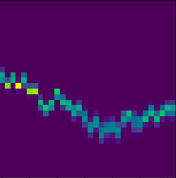
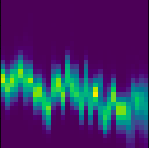

# Deep Transfer Learning for Smallholder Yield Prediction

This repository contains the implementation of a **Spatio-Temporal Graph Attention Network (GAT)** designed for crop yield prediction in data-sparse regions. The framework utilizes differential spatial gating to enable robust cross-continental transfer learning, specifically from Argentina to Brazil.

This research directly supports **United Nations Sustainable Development Goal 2 (Zero Hunger)** by providing scalable agricultural monitoring tools for smallholder environments where ground-truth data is severely limited.

---

## Data Structure

The experiments are conducted using the [SustainBench Dataset](https://sustainlab-group.github.io/sustainbench/docs/datasets/sdg2/crop_yield.html), a benchmark for monitoring the UN Sustainable Development Goals with machine learning.

The input data consists of multispectral satellite imagery processed into multi-band histograms. Each county is represented by a $32 \times 32 \times 9$ tensor, where the 9 channels correspond to the MODIS spectral bands.

<div align="center">
  
  <br><br>
  
  <p><i>Figure 1: Multispectral satellite imagery bands and their conversion into county-level histograms. Images sourced from the <a href="https://sustainlab-group.github.io/sustainbench/docs/datasets/sdg2/crop_yield.html">SustainBench documentation</a> (Yeh et al., 2021).</i></p>
</div>

The dataset structure follows a time-series of these histograms representing the crop growing season, coupled with NDVI (Normalized Difference Vegetation Index) values.

---

## Key Features

* **Spatio-Temporal GATv2:** Dynamically weighs signals from neighboring farms to mitigate local noise and high signal-to-noise ratio (SNR) challenges.
* **Differential Gating Mechanism:** Implements a learnable $\alpha$ parameter to balance local spectral features with regional spatial context, preventing over-smoothing.
* **Cross-Continental Transfer:** Recovers predictive power in regions where domestic training is infeasible due to extreme data scarcity.
* **Spectral-Temporal Encoding:** Integrates MODIS multi-band histograms with NDVI time-series and one-hot encoded temporal signals.

---

## Methodology

The architecture processes multispectral satellite imagery through a CNN-based histogram encoder, which is then refined by a spatial graph regularizer.

<div align="center">
  
</div>

### Spatial Graph Construction
A spatial graph is constructed using a **k-Nearest Neighbors (k-NN)** approach ($k=12$). Edge weights are determined via a Gaussian kernel:

$$W_{ij}=\exp\left(-\frac{d(i,j)^2}{2\sigma^2}\right)$$

### Differential Logic
The model preserves local signals by computing a differential representation ($\Delta_{h}$) between local county features ($h_{local}$) and gated regional signals ($h_{gated}$):

$$h_{combined}=\text{proj}(h_{local})+(\alpha\cdot\Delta_{h})$$

---

## Results

Evaluation was conducted using soybean yields in Argentina and Brazil from 2005 to 2016.

### Performance Summary (Mean $R^2$)

| Model Configuration | Argentina (Domestic) | Brazil (Domestic) | Transfer (Arg $\to$ Bra) |
| :--- | :---: | :---: | :---: |
| Pixel-only Baseline ($k=0$) | 0.1918 | -0.4086 | 0.0732 |
| **Proposed GAT Model ($k=12$)** | **0.2075** | **-0.2043** | **0.2150** |

---

## Getting Started

Follow these steps to set up the environment and run the model on your local device or server.

### 1. Prerequisites
Ensure you have the following installed on your system:
* **Python 3.8+**
* A CUDA-enabled GPU (recommended for PyTorch Geometric operations)
* **Git**

### 2. Environment Setup
Clone the repository and install the required dependencies. It is highly recommended to use a virtual environment:

```bash
# Clone the repository
git clone [https://github.com/your-username/your-repo-name.git](https://github.com/your-username/your-repo-name.git)
cd your-repo-name

# Create and activate a virtual environment 
python3 -m venv venv
source venv/bin/activate  # On Windows, use: venv\Scripts\activate

# Install dependencies
pip install -r requirements.txt
```

### 3. Data Acquisition
Download the Argentina and Brazil `.npz` files from the [SustainBench Dataset](https://sustainlab-group.github.io/sustainbench/). Place them in the `data/` directory so that your structure matches:

```text
data/
├── argentina/
│   ├── train_hists.npz
│   └── dev_hists.npz
└── brazil/
    ├── train_hists.npz
    └── dev_hists.npz
```

### 4. Configuration
Modify `config/params.yml` to set your specific execution parameters. For example:
* Set `TASK: "DOMESTIC_ARG"` to train the base model on Argentina.
* Set `TASK: "TRANSFER_ARG_BRA"` to run the cross-continental transfer to Brazil.

### 5. Execution
Once the data is in place and the configuration is set, run the main training loop:

```bash
python src/main.py
```

---

## Project Structure

```text
project_root/
├── config/
│   └── params.yml      # Hyperparameters and task settings
├── src/
│   ├── gat.py         # CustomGAT and Differential Gating logic
│   ├── main.py        # Training loop and transfer logic
│   └── utils.py       # Data loading and graph construction
├── data/              # SustainBench files
├── models_saved/      # Checkpoints (best_gat.pth)
├── requirements.txt
└── Dockerfile
```